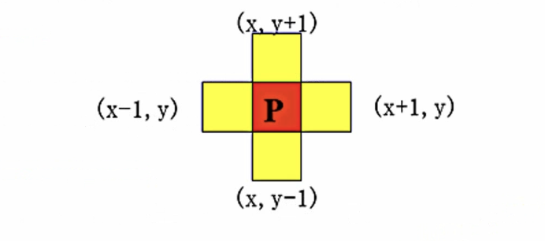
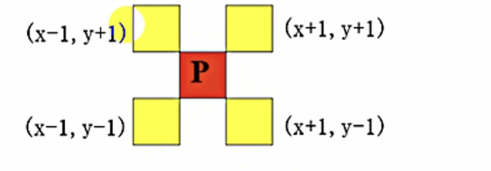

## 课时一

考点：基础知识、相邻像素间的基本关系、直方图处理

数字图像处理概念：借助计算机处理图像

数字图像处理目的：
1. 提高图像视感质量
2. 提取图像中包含的特征或信息
3. 对图像进行变换、编码、压缩、以便于图像存储和传输

像素：数字图像由二维的元素组成，每一个元素具有一个特定的位置（x， y）和幅值f(x, y),这些元素就称为像素。

对于单色（灰度）图像而言，每个像素的亮度用一个数值来表示，通常数值范围在0～255之间，0表示黑，255表示白，其他值表示处于黑白之间的灰度。
彩色图像可以用红、绿、蓝三元组的二维矩阵来表示。通常，三元组的每个数值也是在0到255之间，0表示相应的基色在该像素中没有，而255则代表相应的基色在该像素中取得最大值。

图像数字化技术：
1. 方法：
采样：图像在空间上的离散化。（横坐标数字化）
量化：把采样得到的各像素的灰度值从模拟转换到离散量。（纵坐标的数字化）  
2. 选取原则：
灰度变化满：粗采样，细量化。
灰度变化快：细采样，粗量化。
3. 采样量化不当后果：
采样不够（间隔大）：出现马赛克，但数据量小。
量化不够：假轮廓。但数据量小。

4领域、D领域、8领域
4领域：
像素p（x， y）的4️领域是：(x + 1, y)、(x - 1, y)、(x, y + 1)；（x, y - 1）
用N4(p)表示像素p的4领域

D邻域：像素p(x, y)的邻域是：对角上的点(x + 1, y + 1); (x + 1, y - 1); (x - 1, y + 1); (x - 1, y - 1)
用ND(p)表示像素p的D邻域：

8邻域：像素p(x, y)的8邻域是：4邻域的点 + D邻域的点

连通性（邻接性）：4连通、8连通、m连通（混合）。
4连通：对于具有值V的像素p和q，如果q在集合N4(p)中，称这两个像素是4连通的

8连通：对于具有值V的像素p和q，如果q在集合N8(p)中，称这两个像素是8连通的

M连通：q在集合N4(p)中，或q在集合ND(p)中，并且N4(p)与N4(q)的交集为空(没有值V的像素)则称这两个像素是m连通的，即4连通与D连通的混合连通。

图像增强方法：
点处理：线性灰度变换、分段线性灰度变换、直方图修正法。
局部处理：局部平滑法、领域平均法、灰度最相近的K个邻点平均法、超限像素平滑法、中值滤波法、空间低通滤波法。
全局处理：傅立叶变换

图像增强--直方图处理
目的：使图像清晰，需灰度值变大，即灰度分布变宽、灰度值分布均匀。

直方图均衡化
原理：对图像进行非线性拉伸，即对图像中像素点个数多的灰度级进行扩展，像素点个数小的灰度级进行缩减，使变换后的图像直方图分布均匀、图像清晰。 

## 课时二 图像增强

考点：噪声分类、图像平滑、图像锐化

图像增强--图像平滑（低通滤波器）
目的：消除噪声或模糊图像
噪声分类：
1. 椒盐噪声：由图像传感器、传输信道、解码处理等产生黑白相间的亮暗点噪声幅值相同、出现点随机，用中值滤波效果好，不属于加性或乘性噪声。
2. 高斯噪声：图像上每一点都存在噪声、但噪声位置是随机分布的，用均值滤波的效果好，属于加性噪声。

邻域平均法（线性）：用与滤波器模版对应的邻域像素平均值作为中心像素的输出结果，以便去除突变的像素点。
特点：算法简单，但降低噪声的时候会使图像模糊，对椒盐噪声的平滑效果不理想。

步骤：
1. 邻域平均
2. 阈值法平均滤波（设阈值为2）

中值滤波法（非线性）：将当前像元窗口内所有像元灰度值从小到大排序，中间值作为当前像元输出。
特点：对椒盐噪声处理效果好，对包含有尖顶角物体的图像，用十字形窗口。有较长轮廓线物体的图像，采用方形或圆形窗口。若图像点，线，尖角细节较多，则不宜采用中值滤波。

中值滤波与领域平均的异同：
1. 相同点：都可以起到平滑图像、滤去噪声的功能。
2. 不同点：
均值滤波：线性方法，但不能很好的保护图像的细节，会使图像变得模糊，对高斯噪声表现好。
中值滤波：非线性方法，平滑脉冲噪声有效，保护图像边缘，但可能使边缘较粗，对椒盐噪声表现好。

## 课时三

考点：腐蚀、膨胀、击中与击不中

数字形态学处理：可以简化图像数据，保持它们基本的形状特性，并除去不相干的结构。
